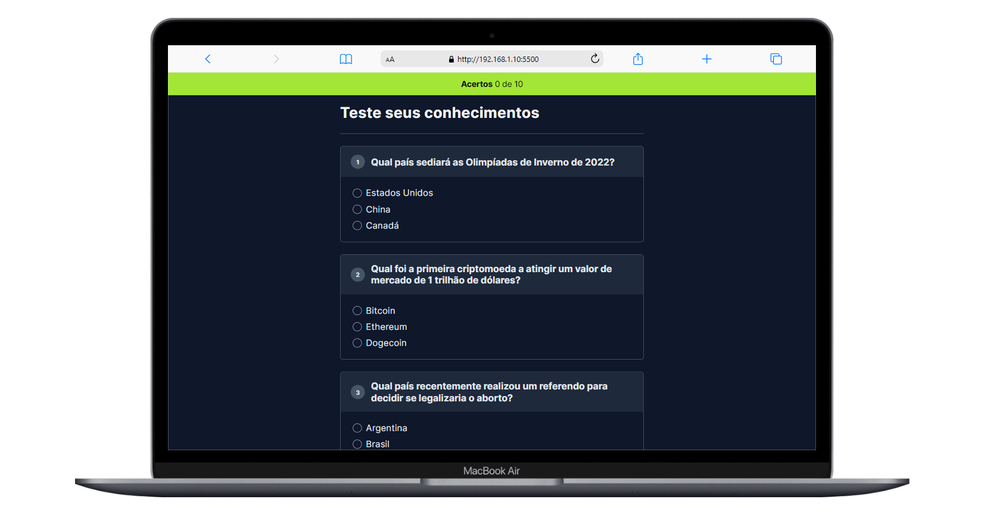

<h1 align="center">
 QUIZ
</h1>

 
    

<!--

  <a href="#-tecnologias">Tecnologias</a>&nbsp;&nbsp;&nbsp;|&nbsp;&nbsp;&nbsp;
  <a href="#-projeto">Projeto</a>&nbsp;&nbsp;&nbsp;|&nbsp;&nbsp;&nbsp;
  <a href="#-funcionalidades">Funcionalidades</a>&nbsp;&nbsp;&nbsp;&nbsp;

-->
 

## 🚀 Tecnologias
Este projeto foi desenvolvido com as seguintes tecnologias:

- HTML
- CSS
- JavaScript

## 🚧 Projeto
Projeto de um Quiz com dez perguntas, cada uma apresentando três alternativas. Desenvolvido durante o evento NLW-experts (com foco em HTML, CSS e JS) da Rocketseat.

Live Preview: https://nlw-experts-quiz.vercel.app/

## Funcionalidades
- Apresentação das Perguntas.
- Opções de Resposta, cada pergunta tem três opções.
- Validação de Resposta.
- Contagem de Pontuação, mostra a quantidade de acertos.
- Design Responsivo.

##  Inspiração:
 NLW-experts Rocketseat.

---

Feito com ♥ by RossoniPablo
